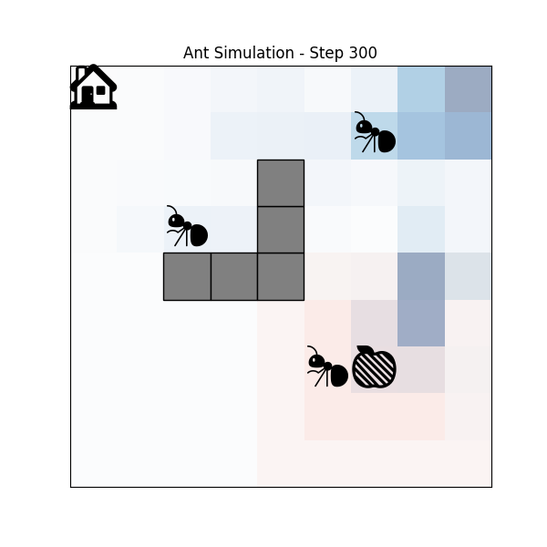
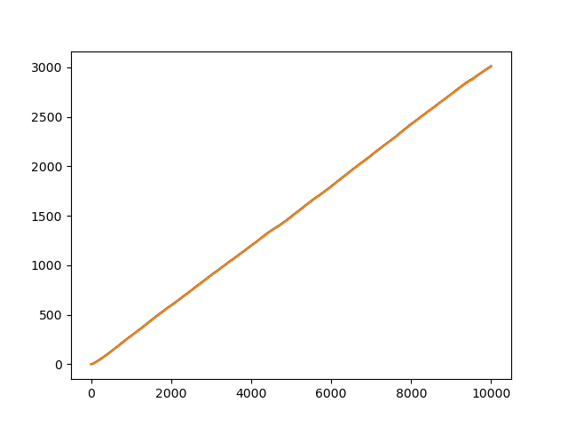
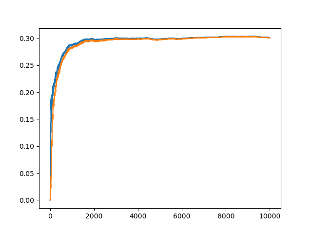

# Weekly progress journal

## Instructions

In this journal you will document your progress of the project, making use of the weekly milestones.

Every week you should 

1. write down **on the day of the lecture** a short plan (bullet list is sufficient) of how you want to 
   reach the weekly milestones. Think about how to distribute work in the group, 
   what pieces of code functionality need to be implemented.
2. write about your progress **until Tuesday, 11:00** before the next lecture with respect to the milestones.
   Substantiate your progress with links to code, pictures or test results. Reflect on the
   relation to your original plan.

We will give feedback on your progress on Tuesday before the following lecture. Consult the 
[grading scheme](https://computationalphysics.quantumtinkerer.tudelft.nl/proj3-grading/) 
for details how the journal enters your grade.

Note that the file format of the journal is *markdown*. This is a flexible and easy method of 
converting text to HTML. 
Documentation of the syntax of markdown can be found 
[here](https://docs.gitlab.com/ee/user/markdown.html#gfm-extends-standard-markdown). 
You will find how to include [links](https://docs.gitlab.com/ee/user/markdown.html#links) and 
[images](https://docs.gitlab.com/ee/user/markdown.html#images) particularly.

## Week 1 - planning the project
(due 21 May 2025, 23:59)

Discussions about the project design are best done in person with the course team or via the planning issue #1. Once your project is approved, copy the project plan here.

Topic: **Simulating an Ant Colony and studying Emergent Behaviour**

Parameters / Observables:
- Time taken for the first ant to reach food
- Number of ants that find the food path
- Minimum, maximum, average path lengths to food
- We can vary the number of ants to see when can they overcome difficult obstacles

Phase 1: Our initial model will involve simulating a 2D grid with food sources and obstacles. Each ant can do a random walk in the 4 cardinal directions based on certain probability that depend on pheromone levels / "scent" of the grid. The food source will have a local "scent" so that ants near it can be attracted towards it. Once an ant discovers a food source, it will retrace it's path back to the colony and drop pheromones along the path for others to follow, and the pheromones will have an evaporation rate.

Phase 2: \
Model enhancements:
- Finite food source
- "Hunger" for ants which may discourage them to go too far
- Amount of food present in the colony can be monitored and measured, based on which ants incentivised to explore far away locations
- Addition of dynamic obstacles to a known food path and how the ants overcome it

We would also like to explore the possibility of modelling each ant as a Neural Network, thereby trying to study if there is a collective intelligence in the colony.
References:

- Biologically inspired ant colony simulation: [Reference Paper](https://graphics.cs.uh.edu/wp-content/papers/2018/2018-CAVW-AntSimulation.pdf)
- Ant Colony Reinforcement Learning: [Code for reference](https://github.com/jeffasante/ant-colony-rl)

## Week 2
(due 27 May 2025, 11:00)

### Planning
@mankritsingh will be creating the initial world, setting up the colony, food source, obstacles and how the ants will move(including pheromones) 

@npaarts will work on computing obeservables for the simulation

@rjuyal will work on making the animation and making things configurable

### Progress Report 

@mankritsingh

- I worked on the basic simulation for the project this week, done in !1. This did not have any pheromone based behaviour and was a simple random walk for 1 ant, but it sets a flexible code design for our project.
- Then I added pheromone related behaviour in !2, and improved plots. This also has the feature to evaporate pheromones.
- Finally, I added pheromone dilution across length of the ant path and improved some outcome logging in !3.

Currently, the simulation looks like this:

Here, the red is the natural food scent (remains static) and blue shades are the ant pheromones. Grey boxes are the obstacles.

@npaarts

- I made the basic simulation use pheromones on the edges in between the nodes as the papers I've found on ACO said it should be done.
- I added an observable for how much food is gathered in total up to each timestep
  
- I also added an observable of the average food gathered per timestep (by 10 ants combined)
  

## Week 3
(due 3 June 2025, 11:00)

## Reminder final deadline

The deadline for project 3 is **9 June 23:59**. By then, you must have uploaded the presentation slides to the repository, and the repository must contain the latest version of the code.
